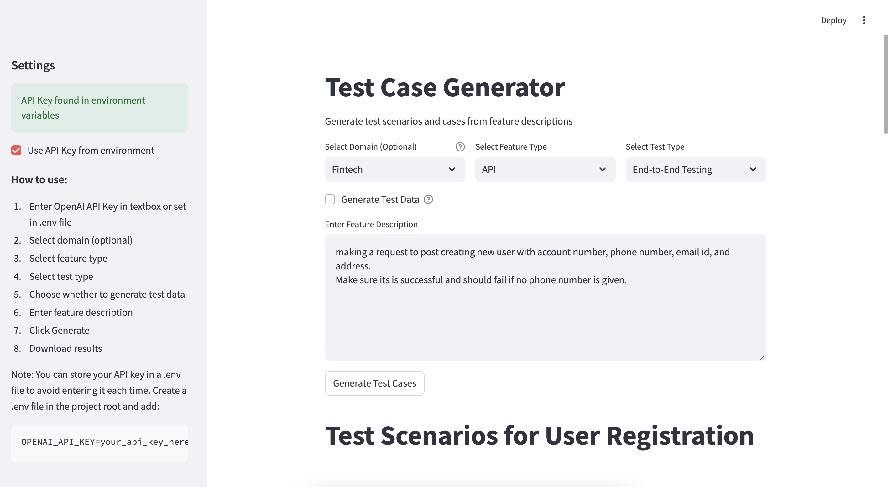

# 🧪 Garuda Test Case Generator

# This is Project Garuda



> Transform feature descriptions into comprehensive test scenarios with AI-powered intelligence

Garuda is an innovative test case generator that leverages OpenAI's GPT-4 to create detailed, context-aware test scenarios and test data. Whether you're testing UI components, APIs, databases, mobile apps, or complex integrations, Garuda helps you generate thorough test cases with just a few clicks.


## ✨ Features

- 🎯 **Smart Test Generation**: Creates detailed test scenarios based on feature descriptions
- 🔄 **Multiple Testing Types**: Supports Smoke, End-to-End, Performance, Regression, Security, and Accessibility testing
- 💡 **Comprehensive Coverage**: Generates test cases for UI, API, Database, Mobile, and Integration features
- 🌍 **Domain-Specific Testing**: Specialized test cases for Fintech, Healthcare, E-commerce, Manufacturing, and Education
- 📊 **Test Data Generation**: Creates realistic test data, mock data, and environment setups
- 🎨 **Beautiful UI**: Streamlit-based interface for easy interaction
- 📝 **Multiple Export Formats**: Download test cases in both Markdown and JSON formats
- 🔐 **Flexible API Key Management**: Use environment variables or UI input for API key

## 🌳 Project Structure

```
ai_test_cases_generator/
├── garuda.py              # Main application file
├── .env                   # API key configuration (create from template)
├── .env.template          # Template for API key configuration
├── .gitignore            # Git ignore rules
├── README.md             # Project documentation
└── requirements.txt      # Python dependencies
```

## 🚀 Getting Started

### Prerequisites

- Python 3.8 or higher
- OpenAI API key
- pip (Python package manager)

### Installation

1. **Clone the repository**
   ```bash
   git clone https://github.com/your-username/ai_test_cases_generator.git
   cd ai_test_cases_generator
   ```

2. **Create and activate virtual environment**
   ```bash
   python -m venv .venv
   source .venv/bin/activate  # On Windows: .venv\Scripts\activate
   ```

3. **Install dependencies**
   ```bash
   pip install -r requirements.txt
   ```

4. **Configure API Key**
   
   Option 1: Using .env file
   ```bash
   cp .env.template .env
   # Edit .env and add your OpenAI API key
   ```
   
   Option 2: Input via UI when running the application

### 🎮 Usage

1. **Start the application**
   ```bash
   streamlit run garuda.py
   ```

2. **Generate Test Cases**
   - Enter your OpenAI API key (if not using .env)
   - Select the feature type (UI/API/Database/Mobile/Integration)
   - Choose the test type
   - Enable test data generation if needed
   - Enter your feature description
   - Click "Generate Test Cases"

3. **Export Results**
   - View generated test cases in the UI
   - Download as Markdown for documentation
   - Download as JSON for automation

## 🎯 Example

Here's a simple example of generating test cases for a login feature:

1. **Feature Description**:
   ```
   User login feature with email and password authentication.
   Includes password reset functionality and account lockout after 3 failed attempts.
   ```

2. **Select Options**:
   - Feature Type: UI
   - Test Type: End-to-End Testing
   - Generate Test Data: Yes

3. **Generated Output Includes**:
   - Test scenarios for successful login
   - Invalid credentials handling
   - Password reset flow
   - Account lockout scenarios
   - Test data with valid/invalid credentials
   - Environment setup requirements

## 🎨 Test Types

### 🔍 Smoke Testing
Quick verification of critical functionality

### 🔄 End-to-End Testing
Complete business flow verification

### ⚡ Performance Testing
System performance and scalability checks

### 🔁 Regression Testing
Impact analysis and existing functionality verification

### 🔒 Security Testing
Security vulnerabilities and compliance checks

### ♿ Accessibility Testing
WCAG compliance and accessibility verification

## 💡 Feature Types

### 🖥️ UI Testing
- Cross-browser compatibility
- Responsive design
- Accessibility compliance
- Input validation
- Error states

### 🔌 API Testing
- HTTP methods
- Request/Response validation
- Authentication/Authorization
- Rate limiting
- Error handling

### 💾 Database Testing
- CRUD operations
- Data integrity
- Transactions
- Concurrent access
- Performance

### 📱 Mobile Testing
- Platform-specific behavior
- Device fragmentation
- Network conditions
- App lifecycle
- Device features

### 🔗 Integration Testing
- System dependencies
- Data flow
- Error handling
- Service contracts
- Asynchronous operations

## 🎯 Domain-Specific Testing

Garuda now supports specialized test case generation for different industries:

### 💰 Fintech
- KYC/AML compliance
- Transaction security
- Payment processing
- Fraud detection
- Financial regulations

### 🏥 Healthcare
- HIPAA compliance
- Patient privacy
- Clinical workflows
- Medical device integration
- Health records management

### 🛒 E-commerce
- Shopping experience
- Payment processing
- Inventory management
- Customer management
- PCI compliance

### 🏭 Manufacturing
- Production systems
- Supply chain
- Quality assurance
- Equipment integration
- Safety standards

### 📚 Education
- Learning management
- User management
- Content delivery
- Assessment systems
- Communication tools

## 🎨 Customization Options

While direct model training isn't possible with GPT-4, Garuda offers several ways to customize test generation for your organization:

### 1. Domain Templates
- Pre-configured templates for different industries
- Industry-specific compliance requirements
- Specialized test scenarios and data

### 2. Custom Prompts
- Modify prompt templates
- Add organization-specific requirements
- Include custom validation rules

### 3. Context Enhancement
- Add industry best practices
- Include company-specific guidelines
- Incorporate regulatory requirements

### 4. Test Data Customization
- Domain-specific test data generation
- Custom validation rules
- Environment-specific configurations

## 📝 Generated Test Data

For each test case, Garuda can generate:

- **Test Inputs**: Valid/invalid values, edge cases
- **Test Payloads**: Request/response examples
- **Mock Data**: External service responses
- **Environment Setup**: Required configurations

## 🙏 Acknowledgments

- OpenAI for the powerful GPT-4 API
- Streamlit for the amazing UI framework
- The testing community for inspiration

---

Made with ❤️ by Kunaal Thanik

*Remember: The best tests are those that find bugs before users do!* 🐛✨
